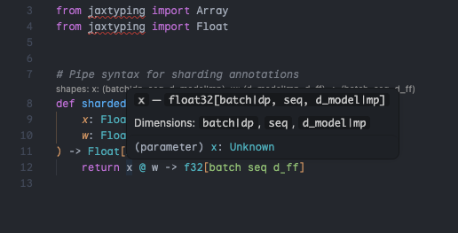
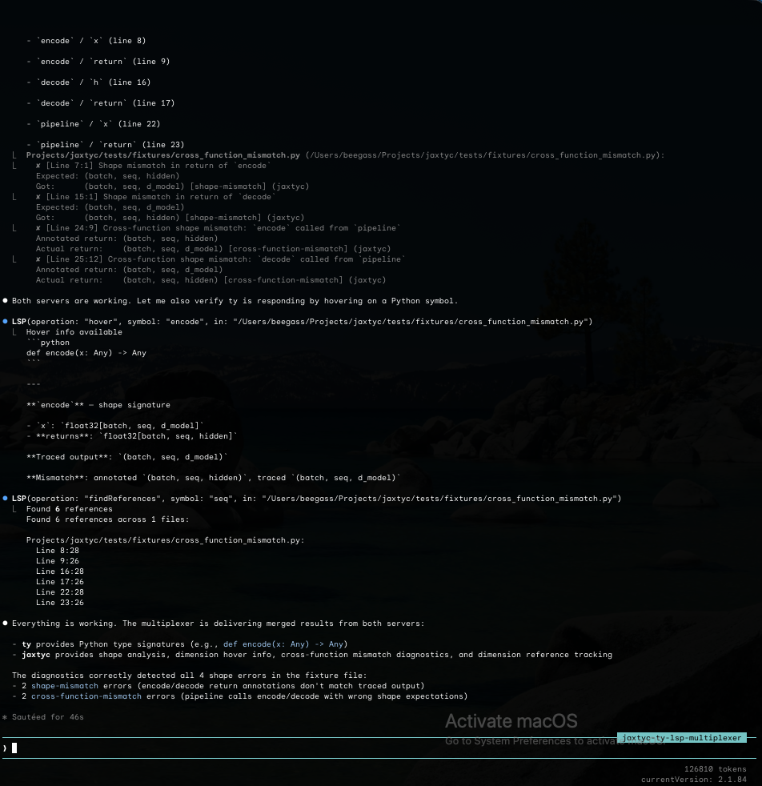

[](https://pypi.org/project/jaxtyc/) [](https://pypi.org/project/jaxtyc/) [](https://github.com/BeeGass/jaxtyc/blob/main/LICENSE)

# jaxtyc

Static array shape checking for JAX powered by `jax.eval_shape`.

Reads [jaxtyping](https://docs.kidger.site/jaxtyping/) annotations and verifies shapes at analysis time -- no runtime cost, no FLOPs. Each named dimension is assigned a unique prime number, making shape mismatches unambiguous.

<p align="center">
  
</p>

<p align="center">
  
</p>

<p align="center">
  <a href="docs/assets/demo.mov">Watch the demo video</a>
</p>

## Features

- **Zero runtime cost** -- `jax.eval_shape` only; no arrays allocated, no computation executed
- **Prime-based symbolic shapes** -- each dimension name maps to a unique prime (>= 101), so `d_in != d_out` is guaranteed
- **10 diagnostic rules** -- shape/rank mismatch, cross-function propagation, parameter consistency, tuple return checking, trace errors
- **Inline suppressions** -- `# jaxtyc: ignore` and `# jaxtyc: ignore[rule-name]`
- **LSP server** -- diagnostics, hover, CodeLens, go-to-definition, references, rename, code actions, completion, semantic tokens, inlay hints, signature help, linked editing, folding, call hierarchy
- **LSP multiplexer** -- `jaxtyc mux` runs ty/pyright + jaxtyc behind a single stdio pipe
- **CLI with 4 output formats** -- `full`, `concise`, `json`, `github` (inline PR annotations)
- **Flax NNX + Equinox support** -- traces bound methods on module instances
- **Configurable via `pyproject.toml`** -- severity threshold, rule ignoring, file exclusion, einops preferences

## Installation

```bash
uv add jaxtyc
```

**Extras:**

| Extra | Installs | Use case |
|-------|----------|----------|
| `jaxtyc[watch]` | `watchfiles` | `jaxtyc watch` -- re-check on file save |
| `jaxtyc[flax]` | `flax >=0.10` | Flax NNX module tracing |
| `jaxtyc[equinox]` | `equinox >=0.11` | Equinox module tracing |
| `jaxtyc[einops]` | `einops >=0.8` | einops-style fix suggestions + inlay hints with pattern dim names |
| `jaxtyc[all]` | All of the above | Everything |

## Quick Start

```python
# model.py
import jax.numpy as jnp
from jaxtyping import Array, Float

def linear(
    x: Float[Array, "batch seq d_in"],
    w: Float[Array, "d_in d_out"],
) -> Float[Array, "batch seq d_out"]:
    return jnp.matmul(x, w.T)  # Bug: .T swaps dims, produces (batch, seq, d_in)
```

```bash
$ jaxtyc check model.py
model.py:8:0: error[shape-mismatch]
  Shape mismatch in return of `linear`
    Expected: (batch, seq, d_out)
    Got:      (batch, seq, d_in)

Found 1 error(s) in 1 function(s) checked (0.03s)
```

## Editor Integration

### VS Code

Install the [jaxtyc extension](editors/vscode/):

```bash
cd editors/vscode && npm install && npm run bundle
npx @vscode/vsce package --allow-missing-repository
code --install-extension jaxtyc-*.vsix
```

Or use the justfile: `just vscode-update`

The extension auto-discovers your Python environment (`.venv`, `VIRTUAL_ENV`, or `jaxtyc` on PATH) and starts the LSP server automatically. Supports multi-root workspaces with per-folder LSP clients. Includes jaxtyping snippets, a trace visualization webview, and a status bar quick pick menu.

### Other Editors

jaxtyc works in any editor that supports LSP (Neovim, Helix, etc.). See the [editor setup docs](https://beegass.github.io/jaxtyc/editors/editors/) for configuration.

## CLI

```
jaxtyc check <paths>...          # Shape-check files or directories
jaxtyc trace <file.py::func>     # Trace intermediate shapes through a function
jaxtyc watch <paths>...          # Watch and re-check on change
jaxtyc lsp                       # Start the LSP server (stdio)
jaxtyc mux                       # Start the LSP multiplexer (ty/pyright + jaxtyc)
jaxtyc version                   # Print version
```

## Documentation

Full docs at [beegass.github.io/jaxtyc](https://beegass.github.io/jaxtyc/).

## License

MIT
