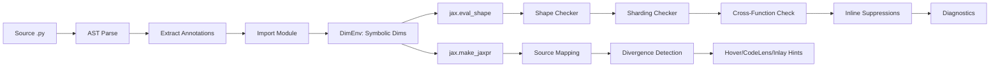

# Architecture

## Analysis Pipeline

The pipeline has two output paths from `DimEnv`. The primary path (`eval_shape` -> shape checker -> sharding checker -> cross-function check -> suppressions -> diagnostics) powers the `check` command and LSP error reporting. The secondary path (`make_jaxpr` -> source mapping -> divergence detection) powers the `trace` command, LSP hover, CodeLens, and inlay hints with error annotations. The pipeline uses abstract-first model tracing (falling back to concrete construction on CPU) and applies einops post-processing for rearrange/reduce/repeat calls.

---

## Module Responsibilities

| Module | File | Responsibility |
|--------|------|---------------|
| annotations | `analyzer/annotations.py` | AST-based jaxtyping annotation parser. Extracts `FunctionShapeSpec` from `Float[Array, "batch seq d_model"]`-style type hints. Also extracts `DimLocation` for cross-file navigation and `CallSite` for cross-function analysis. |
| dim_env | `analyzer/dim_env.py` | Symbolic dimension environment. Maps each named dimension to a unique symbolic dimension via `jax.export.symbolic_shape`. Uses `get_concrete_size`/`make_concrete_shape` for NNX/equinox modules that need plain ints. Shared per file. |
| importer | `analyzer/importer.py` | Dynamic module import with venv auto-discovery. Finds virtual environments (following ty's resolution order), adds `site-packages` to `sys.path`, and loads user `.py` files via `importlib`. Runs `exec_module` inside `jax.default_device(cpu)` and removes `_jaxtyc_user_*` entries from `sys.modules` after loading. |
| tracer | `analyzer/tracer.py` | `jax.eval_shape` / `jax.make_jaxpr` wrappers. Builds `ShapeDtypeStruct` inputs from specs, runs tracing, extracts output shapes and intermediates. Extracts `ShardingInfo` from `sharding_constraint` and `shard_map` jaxpr primitives. Handles single and multi-output (PyTree) returns. |
| source_map | `analyzer/source_map.py` | Jaxpr `source_info` extraction. Walks jaxpr equations to find user-code frames, filtering out JAX-internal stack frames. |
| checker | `analyzer/checker.py` | Shape comparison: expected vs actual. Emits `shape-mismatch`, `rank-mismatch`, `trace-error`, `param-inconsistency`, `cross-function-mismatch`, and `return-count-mismatch` diagnostics. Attaches `DiagnosticData` with structured shape info and suggested fixes. |
| divergence | `analyzer/divergence.py` | Divergence detection. Given a function's expected return shape and traced intermediates, finds the first intermediate whose shape deviates from expected. Returns `ErrorHintInfo` for inline error display in inlay hints. |
| sharding_checker | `analyzer/sharding_checker.py` | Sharding validation. Checks `PartitionSpec` consistency against array ranks and mesh axes. Implements 8 rules: `sharding-rank-mismatch`, `sharding-axis-unknown`, `sharding-conflict`, `sharding-io-mismatch`, `sharding-propagation-mismatch`, `sharding-annotation-incomplete`, `sharding-dim-conflict`, `sharding-mesh-undefined`. |
| suppressions | `analyzer/suppressions.py` | Inline suppression comment parsing. Extracts `# jaxtyc: ignore` and `# jaxtyc: ignore[rule-name]` comments and filters matching diagnostics. |
| einops_parser | `analyzer/einops_parser.py` | Parse einops pattern strings into output dimension names. Used for post-processing einops rearrange/reduce/repeat calls. |
| einops_detector | `analyzer/einops_detector.py` | AST-based detection of `einops.rearrange`, `einops.reduce`, and `einops.repeat` calls. Identifies einops call sites for shape analysis. |
| mesh_resolver | `analyzer/mesh_resolver.py` | AST-based mesh shape and `axis_rules` inference. Resolves mesh topology for sharding validation. |
| _errors | `analyzer/_errors.py` | Error message truncation. Formats and shortens tracing error messages for diagnostics. |
| pipeline | `analyzer/pipeline.py` | End-to-end orchestration. Sequences parse -> import -> trace -> check -> sharding check -> cross-function -> suppress for a single file. Entry point: `analyze_file()`. Uses abstract-first model tracing (falling back to concrete on CPU) and einops post-processing. Handles Flax NNX and Equinox module tracing with dimension-aware constructor kwargs. Calls `jax.clear_caches()` after each analysis cycle to prevent unbounded cache growth. |
| config | `config.py` | `[tool.jaxtyc]` config loading from `pyproject.toml`. Supports severity filtering, rule ignoring, file exclusion, einops preferences, hover compaction, nested `[tool.jaxtyc.hints]` and `[tool.jaxtyc.sharding]` subsections. |
| main | `cli/main.py` | CLI entry point. Calls `_enforce_cpu_backend()` before any JAX import, setting `JAX_PLATFORMS=cpu` unless overridden by `JAXTYC_BACKEND=gpu` or an explicit `JAX_PLATFORMS` env var. |
| formatters | `cli/formatters.py` | Output formatters: `full` (human-readable), `concise` (one-liner), `json` (machine-readable), `github` (Actions annotations). |
| server | `lsp/server.py` | pygls-based LSP server core. Runs `_analyze_and_publish` with content-hash gating (SHA-256 of source text; skips re-analysis on unchanged files), debouncing, progress reporting, and divergence detection. Imports 10 handler sub-modules that register 29 LSP method handlers. Caches error hints and source text for inlay hint rendering. Calls `jax.clear_caches()` after each analysis cycle. |
| mux | `lsp/mux.py` | LSP multiplexer. Runs ty/pyright + jaxtyc behind a single stdio pipe with dual-send request merging, deferred server spawning, and diagnostic aggregation. |
| suggestions | `lsp/suggestions.py` | Shape fix generation. Produces JAX-native (`jnp.transpose`, `jnp.expand_dims`, `jnp.squeeze`, `jnp.reshape`) and einops-style suggestions for code actions. |
| index | `lsp/index.py` | `WorkspaceIndex` for cross-file navigation. Thread-safe index of functions, dimension locations, and call sites across all open files. |

---

## Data Flow

1. **Parse**: `extract_function_specs(source, path)` walks the AST and returns a `list[FunctionShapeSpec]` -- one per function that has at least one jaxtyping annotation. Also extracts `DimLocation` and `CallSite` data for navigation and cross-function analysis.

2. **Import**: `import_module_from_path(path)` discovers the project's virtual environment (following ty's resolution order: `VIRTUAL_ENV` -> `.venv` at project root -> walk-up), adds `site-packages` to `sys.path`, and loads the user module so JAX can trace its functions.

3. **Dimension assignment**: A shared `DimEnv` is created per file with reserved literal sizes. Each named dimension (e.g., `batch`, `seq`, `d_model`) gets a unique symbolic dimension via `jax.export.symbolic_shape`. Fixed dimensions (literal integers in annotations) keep their original values. Sharing the `DimEnv` across all functions in a file ensures the same dimension name always maps to the same symbolic value, enabling cross-function consistency checking. For NNX/equinox modules that require plain ints, `get_concrete_size`/`make_concrete_shape` provide a concrete fallback.

4. **Tracing**: `jax.eval_shape(fn, **abstract_inputs)` propagates shapes through the function without running computation. The abstract inputs are `ShapeDtypeStruct` objects built from the symbolically-assigned shapes. For Flax NNX modules, abstract construction via `nnx.eval_shape` avoids allocation; the model is split via `nnx.split/merge` and traced with `jax.eval_shape`. For Equinox modules, `eqx.filter_eval_shape` traces bound methods similarly. If abstract construction fails, the pipeline falls back to concrete construction on CPU. During tracing, `_extract_intermediates` also detects sharding primitives (`sharding_constraint`, `shard_map`) and attaches `ShardingInfo` to each intermediate shape.

5. **Checking**: The checker compares the traced output shape against the return annotation's expected shape (also built from symbolic dimensions via the same `DimEnv`). Parameter shapes are also verified against traced inputs. Mismatches produce diagnostics with `DiagnosticData` carrying expected/actual shapes, dimension name mappings, and suggested fixes.

6. **Cross-function propagation**: `extract_call_sites()` finds calls between annotated functions. For each call site, `check_call_site()` verifies that the callee's traced output matches its annotation, emitting `cross-function-mismatch` if not.

7. **Inline suppressions**: `extract_suppressions()` parses `# jaxtyc: ignore` comments, and `filter_inline_suppressions()` removes matching diagnostics.

8. **Sharding validation**: After shape checking, `check_sharding()` validates sharding constraints found on intermediates. It checks partition spec rank against array rank, verifies mesh axis names exist, detects conflicting specs, and flags jit/constraint mismatches.

9. **Source mapping** (optional): `jax.make_jaxpr` is run separately to extract per-equation source locations. Each equation's `source_info.traceback.frames` is filtered to find the user's source line, skipping JAX internals.

10. **Divergence detection** (LSP only): `find_divergence_points()` compares traced intermediates against the expected return shape, finding the first operation whose output deviates. The result (`ErrorHintInfo`) is cached and displayed as an inline error annotation in inlay hints.

---

## Design Principles

**Zero runtime cost.** jaxtyc is a static analysis tool. It uses `jax.eval_shape` which performs no actual computation -- only shape propagation through abstract values. Analyzed code is never executed with real data.

**Unambiguous shapes via symbolic dimensions.** Every named dimension gets a unique symbolic value from `jax.export.symbolic_shape`. These abstract values stay distinct through JAX's tracing: if dim `a` != dim `b`, then expressions like `a + b`, `a * b`, etc. produce new symbolic expressions that are provably different. No combination of operations (transpose, reshape, matmul) can accidentally produce a shape that matches the expected shape when the actual computation is wrong. See [Internals](internals.md#symbolic-dimensions) for details.

**Graceful degradation.** Files without jaxtyping annotations are silently skipped (zero diagnostics, zero errors). Import failures, resolve failures, and trace failures produce info-level diagnostics rather than crashing. The tool always produces a `FileResult`, even on failure.

**CPU-only by default.** The CLI entry point (`cli/main.py`) calls `_enforce_cpu_backend()` before any JAX import, setting `JAX_PLATFORMS=cpu`. This ensures analysis never accidentally allocates GPU memory or triggers device transfers. Override with `JAXTYC_BACKEND=gpu` or by setting `JAX_PLATFORMS` directly. The VSCode extension and mux also set CPU env vars on spawned processes.

**Content-hash gating.** The LSP server computes a SHA-256 hash of each file's source text and skips re-analysis when the hash matches the cached value. This avoids redundant tracing on saves that do not change content (e.g., auto-formatters). After each analysis cycle, `jax.clear_caches()` is called to prevent unbounded JAX trace cache growth.

**Composable with existing tooling.** jaxtyc runs alongside pyright, ty, pylsp, ruff, or any other Python tool. The LSP server publishes diagnostics under the `jaxtyc` source name so they are distinguishable. The `jaxtyc mux` multiplexer merges jaxtyc with a type checker behind a single stdio pipe for editors that only support one server per language. The CLI supports `--format github` for CI integration.
