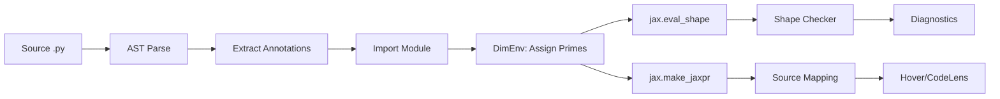

# Architecture

## Analysis Pipeline

The pipeline has two output paths from `DimEnv`. The primary path (`eval_shape` -> checker -> diagnostics) powers the `check` command and LSP error reporting. The secondary path (`make_jaxpr` -> source mapping) powers the `trace` command, LSP hover, and CodeLens.

---

## Module Responsibilities

| Module | File | Responsibility |
|--------|------|---------------|
| annotations | `analyzer/annotations.py` | AST-based jaxtyping annotation parser. Extracts `FunctionShapeSpec` from `Float[Array, "batch seq d_model"]`-style type hints. |
| dim_env | `analyzer/dim_env.py` | Prime sieve dimension environment. Maps each named dimension to a unique prime for unambiguous symbolic tracing. |
| importer | `analyzer/importer.py` | Dynamic module import for tracing. Loads user `.py` files via `importlib` so live function objects are available to JAX. |
| tracer | `analyzer/tracer.py` | `jax.eval_shape` / `jax.make_jaxpr` wrappers. Builds `ShapeDtypeStruct` inputs from specs, runs tracing, extracts output shapes and intermediates. |
| source_map | `analyzer/source_map.py` | Jaxpr `source_info` extraction. Walks jaxpr equations to find user-code frames, filtering out JAX-internal stack frames. |
| checker | `analyzer/checker.py` | Shape comparison: expected vs actual. Emits `shape-mismatch`, `rank-mismatch`, and `trace-error` diagnostics. |
| pipeline | `analyzer/pipeline.py` | End-to-end orchestration. Sequences parse -> import -> trace -> check for a single file. Entry point: `analyze_file()`. |
| config | `config.py` | `[tool.jaxtyc]` config loading from `pyproject.toml`. Supports severity filtering, rule ignoring, and file exclusion. |
| formatters | `cli/formatters.py` | Output formatters: `full` (human-readable), `concise` (one-liner), `json` (machine-readable), `github` (Actions annotations). |
| server | `lsp/server.py` | pygls-based LSP server. Registers `didOpen`, `didSave`, `didChange` (debounced), `hover`, and `codeLens` handlers. |

---

## Data Flow

1. **Parse**: `extract_function_specs(source, path)` walks the AST and returns a `list[FunctionShapeSpec]` -- one per function that has at least one jaxtyping annotation.

2. **Import**: `import_module_from_path(path)` loads the user module into the current process so JAX can trace its functions. The parent directory is added to `sys.path`.

3. **Dimension assignment**: A fresh `DimEnv` is created per function. Each named dimension (e.g., `batch`, `seq`, `d_model`) gets a unique prime (2, 3, 5, ...). Fixed dimensions (literal integers in annotations) keep their original values.

4. **Tracing**: `jax.eval_shape(fn, **abstract_inputs)` propagates shapes through the function without running computation. The abstract inputs are `ShapeDtypeStruct` objects built from the prime-assigned shapes.

5. **Checking**: The checker compares the traced output shape against the return annotation's expected shape (also built from primes via the same `DimEnv`). Mismatches produce diagnostics.

6. **Source mapping** (optional): `jax.make_jaxpr` is run separately to extract per-equation source locations. Each equation's `source_info.traceback.frames` is filtered to find the user's source line, skipping JAX internals.

---

## Design Principles

**Zero runtime cost.** jaxtyc is a static analysis tool. It uses `jax.eval_shape` which performs no actual computation -- only shape propagation through abstract values. Analyzed code is never executed with real data.

**Unambiguous shapes via primes.** Every named dimension gets a unique prime number. Since primes are coprime by definition, no combination of operations (transpose, reshape, matmul) can accidentally produce a shape that matches the expected shape when the actual computation is wrong. See [Internals](internals.md#prime-sieve-dimensions) for details.

**Graceful degradation.** Files without jaxtyping annotations are silently skipped (zero diagnostics, zero errors). Import failures, resolve failures, and trace failures produce info-level diagnostics rather than crashing. The tool always produces a `FileResult`, even on failure.

**Composable with existing tooling.** jaxtyc runs alongside pyright, pylsp, ruff, or any other Python tool. The LSP server publishes diagnostics under the `jaxtyc` source name so they are distinguishable. The CLI supports `--format github` for CI integration.
